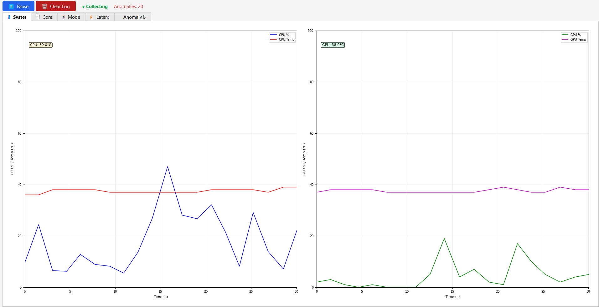

# ML System Anomaly Detector

A real‑time system monitoring tool that collects CPU/GPU metrics, detects anomalies using multiple machine learning models, and displays results in a PyQt5 GUI. Supports both unsupervised (Isolation Forest, One‑Class SVM, …) and supervised (Random Forest, XGBoost, RL agent) detectors.

 <!-- optional: add a screenshot later -->

## Features

- **Live metric collection** – CPU usage, frequency, memory, temperature; GPU usage, memory, temperature (via `psutil`, `GPUtil`, and a background WMI thread for CPU temperature on Windows).
- **Multi‑detector inference** – Compare outputs of 7+ detectors in real time.
- **Rich PyQt5 GUI** – Tabs for system overview, per‑core usage, model scores, latency statistics, and an anomaly event log.
- **Alerting system** – Desktop notifications (via `plyer`) and terminal bell when anomalies or drift are detected.
- **Online drift detection** – Page‑Hinkley test on anomaly scores to signal when the model may need retraining.
- **CSV logging** – All samples, predictions, and latencies are saved for later analysis.
- **Modular detector design** – Easily add new detectors by inheriting from `BaseDetector`.

## Project Structure
.
├── detectors/ # All detector implementations
│ ├── base.py
│ ├── isolation_forest.py
│ ├── oneclass_svm.py
│ ├── local_outlier.py
│ ├── pca_reconstruction.py
│ ├── random_forest.py
│ ├── xgboost_detector.py
│ ├── rl_agent.py
│ └── ensemble_detector.py
├── data/ # Training / test data (created by collection scripts)
├── isolation_forest.pkl # Pre‑trained model (optional)
├── rl_agent.keras # Pre‑trained neural network
├── rl_agent_scaler.pkl # Scaler for RL agent
├── alerts.jsonl # Alert history (created at runtime)
├── performance_log.csv # Detailed log (created at runtime)
├── collect_normal.py # Collect normal‑only training data
├── collect_labeled.py # Collect labeled data (normal / anomaly toggled by keyboard)
├── split_data.py # Split raw labeled data into train/test
├── train_model.py # Train Isolation Forest on normal data
├── train_rl.py # Train the RL agent (neural network)
├── comparison.py # Benchmark all detectors on test data
├── monitor.py # Main GUI application
├── gui_monitor.py # Alternative GUI (older version)
├── alerting.py # Non‑blocking alert system
├── logger.py # Thread‑safe CSV logger
├── data_collector.py # Hardware metric collection
├── process_tracker.py # Top‑process monitoring (optional)
├── test.py # Quick test for RL agent
├── requirements.txt
└── README.md