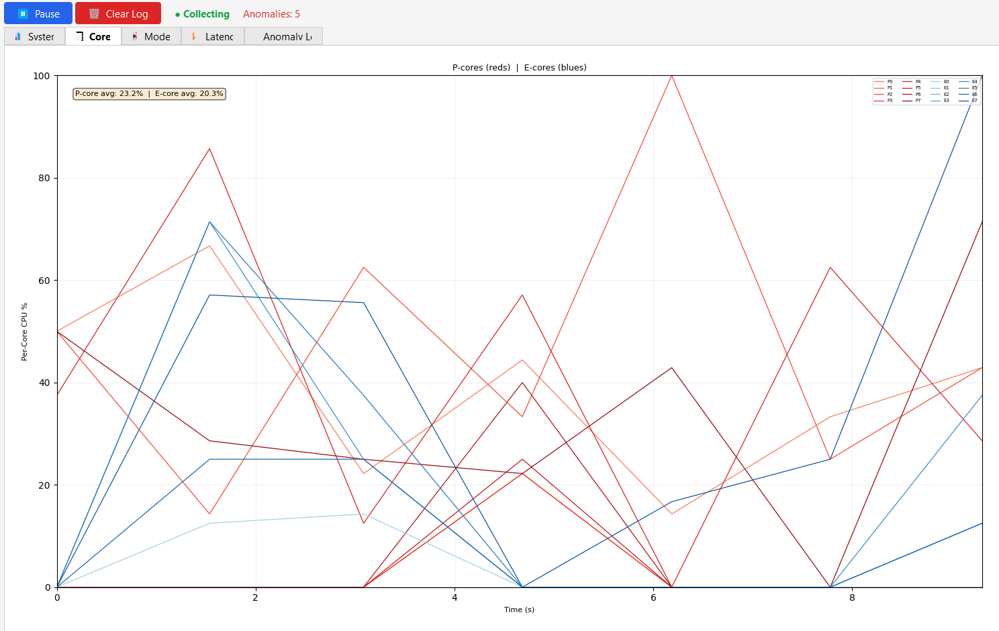
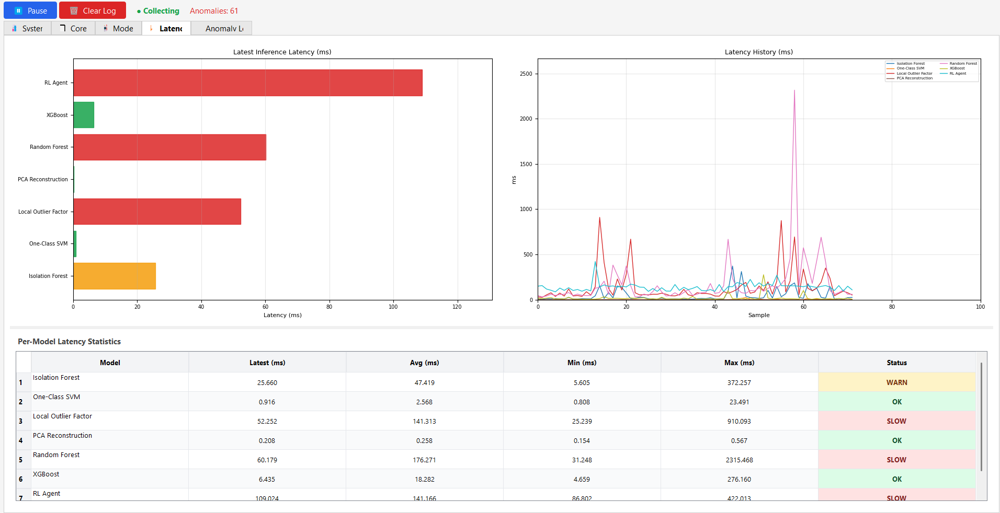
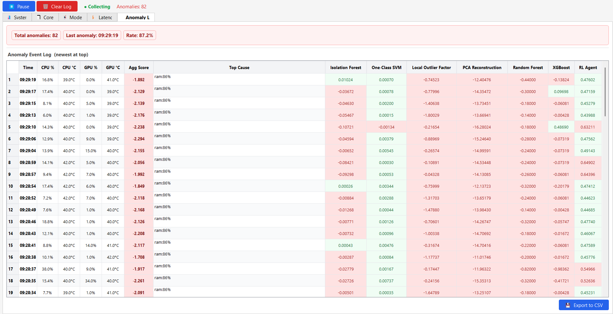
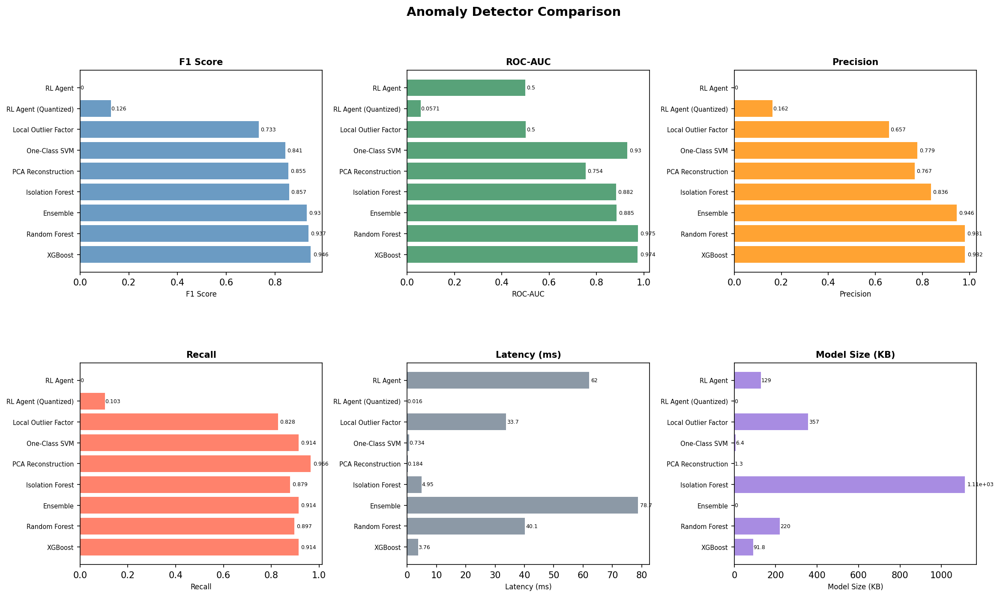

# 🖥️ ML System Anomaly Detector

A real-time system monitoring tool that collects CPU/GPU hardware metrics and detects anomalies using an ensemble of machine learning models, with a live PyQt5 dashboard, desktop alerting, and detailed CSV logging.


---

## 🖼️ Dashboard Screenshots

The PyQt5 GUI is organized into tabs, each surfacing a different layer of monitoring data.

> **To add screenshots:** upload images to `docs/` on GitHub and they will render here automatically.

<table>
  <tr>
    <td align="center" width="50%">
      
      <br/>
      <b>1 · System Overview</b>
      <br/>
      <sub>Live gauges for all 7 features — CPU usage, frequency, memory &amp; temperature plus GPU load, memory &amp; temperature. Color-codes green → amber → red as values climb.</sub>
    </td>
    <td align="center" width="50%">
      
      <br/>
      <b>2 · Per-Core CPU Usage</b>
      <br/>
      <sub>Breaks utilization down by logical core, distinguishing P-cores (Performance) from E-cores (Efficiency) on hybrid Intel CPUs. Spots single-threaded bottlenecks a rolled-up % would hide.</sub>
    </td>
  </tr>
  <tr>
    <td align="center" width="50%">
      
      <br/>
      <b>3 · Model Score Timeline</b>
      <br/>
      <sub>Scrolling time-series of raw anomaly scores per detector. Normal samples sit above zero; anomalous samples dip below. Agreement across models signals high confidence.</sub>
    </td>
    <td align="center" width="50%">
      
      <br/>
      <b>4 · Latency &amp; Performance Stats</b>
      <br/>
      <sub>Per-detector inference latency with rolling average, P99, and max. Sudden spikes are an early indicator of memory pressure or I/O contention on the host.</sub>
    </td>
  </tr>
  <tr>
    <td align="center" colspan="2">
      
      <br/>
      <b>5 · Anomaly Event Log</b>
      <br/>
      <sub>Scrollable table of every alert with timestamp, score, and plain-English explanation of the top-3 deviating features — e.g. <code>gpu_memory: 14.2 (high, expected ≈9.4, z=1.9)</code>. Color-coded by severity.</sub>
    </td>
  </tr>
</table>

---

## 📊 Benchmark Results

All eight detectors were evaluated on the same labeled test set. Supervised models (XGBoost, Random Forest) achieved the highest F1 scores, while One-Class SVM led among unsupervised methods on ROC-AUC.

| Detector | F1 Score | ROC-AUC | Precision | Recall | Latency (ms) |
|---|---|---|---|---|---|
| **XGBoost** | **0.966** | 0.974 | 0.992 | 0.914 | ~5 |
| **Random Forest** | 0.937 | 0.975 | 0.981 | 0.897 | 41.4 |
| **RL Agent** | 0.929 | 0.056* | 0.963 | 0.897 | 63.1 |
| **Ensemble** | 0.898 | 0.876 | 0.883 | 0.914 | 78.7 |
| Isolation Forest | 0.857 | 0.882 | 0.836 | 0.879 | 4.98 |
| One-Class SVM | 0.841 | **0.930** | 0.779 | 0.914 | 1.01 |
| PCA Reconstruction | 0.812 | 0.635 | 0.700 | 0.966 | 0.143 |
| Local Outlier Factor | 0.733 | 0.500 | 0.657 | 0.828 | 37.5 |

> \* RL Agent ROC-AUC reflects the binary classification output format rather than a continuous anomaly score.



---

## ✨ Features

- **Live hardware metrics** — CPU usage, frequency, memory, and temperature (via a non-blocking background WMI thread on Windows); GPU load, memory, and temperature via `GPUtil`
- **8 anomaly detectors** — Isolation Forest, One-Class SVM, Local Outlier Factor, PCA Reconstruction, Random Forest, XGBoost, a neural-network RL agent, and a voting Ensemble
- **PyQt5 dashboard** — Tabbed UI with system overview, per-core usage charts, model score timelines, latency stats, and a live anomaly event log
- **Smart alerting** — Desktop notifications via `plyer` with configurable cooldowns; falls back to terminal bell; all alerts persisted to `alerts.jsonl`
- **Online drift detection** — Page-Hinkley test on the score stream signals when the model distribution has shifted and retraining may be needed
- **Thread-safe CSV logging** — Every sample, prediction, score, latency, jitter, and drift flag is written to `performance_log.csv` with a summary on close
- **Modular detector design** — Add a new detector by inheriting from `BaseDetector` and registering it in `comparison.py` / `monitor.py`

---

## 🗂️ Project Structure

```
.
├── detectors/                  # All detector implementations
│   ├── base.py                 # BaseDetector + FEATURE_ORDER
│   ├── isolation_forest.py
│   ├── oneclass_svm.py
│   ├── local_outlier.py
│   ├── pca_reconstruction.py
│   ├── random_forest.py
│   ├── xgboost_detector.py
│   ├── rl_agent.py
│   └── ensemble_detector.py
│
├── data/                       # Training / test data (created by collection scripts)
│   ├── normal_training.csv
│   ├── labeled_raw.csv
│   ├── labeled_training.csv
│   └── labeled_test.csv
│
├── monitor.py                  # Main GUI application (entry point)
├── alerting.py                 # Non-blocking alert system
├── anomaly_detector.py         # Standalone IsolationForest wrapper with drift detection
├── logger.py                   # Thread-safe CSV logger
├── data_collector.py           # Hardware metric collection
├── process_tracker.py          # Top-process monitoring
│
├── collect_normal.py           # Step 1 – collect normal baseline data
├── collect_labeled.py          # Step 2 – collect labeled data (keyboard-toggled)
├── train_rl.py                 # Train the RL agent (neural network)
├── comparison.py               # Benchmark all detectors
│
├── rl_agent.keras              # Pre-trained neural network weights
├── rl_agent_scaler.pkl         # StandardScaler for RL agent
├── isolation_forest.pkl        # Pre-trained IsolationForest (optional)
│
├── comparison_results.csv      # Latest benchmark results
├── comparison_plots.png        # Benchmark visualisation
├── alerts.jsonl                # Runtime alert history
├── performance_log.csv         # Runtime sample log
└── requirements.txt
```

---

## 🚀 Quick Start

### 1. Install dependencies

```bash
pip install -r requirements.txt
```

> **Windows only:** CPU temperature reading requires [OpenHardwareMonitor](https://openhardwaremonitor.org/) to be running and the `wmi` package: `pip install wmi`.

### 2. Collect normal baseline data (≥10 min recommended)

```bash
python collect_normal.py
```

Use your computer normally during collection — no stress tests. Saves to `data/normal_training.csv`.

### 3. Collect labeled data for supervised models

```bash
python collect_labeled.py
```

| Key | Action |
|-----|--------|
| `a` | Switch to **anomaly** mode (run a stress test now) |
| `n` | Return to **normal** mode |
| `q` | Stop early and save |

Saves to `data/labeled_raw.csv`. Then split into train/test:

```bash
python split_data.py
```

### 4. Train models

```bash
# Train IsolationForest on normal data only
python train_model.py

# Train the neural-network RL agent on labeled data
python train_rl.py
```

All other detectors (RF, XGBoost, LOF, PCA, SVM) are trained automatically at runtime.

### 5. Benchmark all detectors

```bash
python comparison.py
```

Produces `comparison_results.csv` and `comparison_plots.png`.

### 6. Launch the live monitor

```bash
python monitor.py
```

---

## 🧠 How It Works

### Data Collection

`data_collector.py` gathers seven core features every second:

| Feature | Source |
|---|---|
| `cpu_percent` | `psutil.cpu_percent()` |
| `cpu_freq` | `psutil.cpu_freq()` |
| `cpu_memory` | `psutil.virtual_memory().percent` |
| `cpu_temp` | WMI (background thread) / `psutil.sensors_temperatures()` |
| `gpu_percent` | `GPUtil` |
| `gpu_memory` | `GPUtil` |
| `gpu_temp` | `GPUtil` |

CPU temperature is read in a dedicated background thread (with its own `CoInitialize` on Windows) so it never blocks the main producer loop.

### Anomaly Detection Pipeline

```
Raw metrics → Feature vector (7 values)
           → Each detector's predict()      → pred ∈ {1, -1}, score, latency
           → AnomalyExplainer (z-scores)    → top-3 deviating features
           → DriftDetector (Page-Hinkley)   → drift flag
           → Alerter                        → desktop notification / log
           → CSVLogger                      → performance_log.csv
```

### Drift Detection

The `DriftDetector` runs a Page-Hinkley test on the anomaly score stream. When the cumulative deviation from the running mean exceeds a configurable threshold (default 50), a drift flag is raised and the alerting system fires a drift alert, suggesting retraining.

---

## 📝 Logging & Performance Reports

### Runtime Log — `performance_log.csv`

Every sample written by the monitor is appended to `performance_log.csv` in real time. The logger is thread-safe, flushes to disk every 10 rows, and registers an `atexit` handler so the file is always closed cleanly even if the application crashes.

| Column | Type | Description |
|---|---|---|
| `timestamp` | float | Unix epoch of the sample |
| `elapsed_s` | float | Seconds since the logger was opened |
| `cpu_percent` | float | Overall CPU utilisation (%) |
| `cpu_freq` | float | Current CPU frequency (MHz) |
| `cpu_memory` | float | RAM utilisation (%) |
| `cpu_temp` | float | CPU package temperature (°C) |
| `gpu_percent` | float | GPU load (%) |
| `gpu_memory` | float | GPU memory utilisation (%) |
| `gpu_temp` | float | GPU temperature (°C) |
| `anomaly` | int | Detector verdict: `1` = normal, `-1` = anomaly |
| `score` | float | Raw decision-function score (negative = more anomalous) |
| `inference_latency_ms` | float | Time taken for model inference (ms) |
| `jitter_ms` | float | Deviation from the ideal 1-second sample interval (ms) |
| `drift_detected` | int | `1` if Page-Hinkley drift flag is raised, else `0` |

**Sample session stats** (from a real ~7-minute run):

| Metric | Value |
|---|---|
| Total samples | 402 |
| Anomalies detected | 208 (51.7%) |
| Avg inference latency | 1.00 ms |
| P99 / Max latency | 1.00 ms / 1.00 ms |
| Mean anomaly score | −0.0089 |
| Score std deviation | 0.2870 |
| Session duration | ~6.7 minutes |
| Drift events | 0 |

> A 51.7% anomaly rate during this particular session reflects an active stress-test period during labeled data collection — in normal idle use the rate is considerably lower.

### Summary Report — `performance_log.summary.txt`

When the logger closes (on clean exit or `atexit`), it writes a companion summary file alongside the CSV:

```
Log file      : logs\performance_log.csv
Total rows    : 402
Anomalies     : 208 (51.7%)
Avg latency   : 1.00 ms
P99 latency   : 1.00 ms
Max latency   : 1.00 ms
Mean score    : -0.0089
Score std     : 0.2870
```

### Alert Log — `alerts.jsonl`

Every alert fired by the `Alerter` is appended to `alerts.jsonl` as a newline-delimited JSON record. The file survives across sessions and is never truncated, making it a durable audit trail.

**Record schema:**

```jsonc
{
  "time":        "2026-02-18T09:39:55.515272",   // ISO-8601 local time
  "kind":        "anomaly",                        // "anomaly" | "drift"
  "score":       -0.4734,                          // raw decision score
  "explanation": [                                 // top-3 deviating features
    "gpu_memory: 8.0 (high, expected ≈6.6, z=25.5)",
    "gpu_temp: 42.0 (high, expected ≈40.1, z=6.9)",
    "cpu_memory: 43.6 (high, expected ≈42.8, z=4.4)"
  ],
  "metrics": {                                     // raw feature snapshot
    "cpu_percent": 35.5,
    "cpu_freq": 3100.0,
    "cpu_memory": 43.6,
    "cpu_temp": 54.26,
    "gpu_percent": 12.0,
    "gpu_memory": 8.03,
    "gpu_temp": 42.0
  }
}
```

**Stats from a real session (234 alerts over ~55 minutes):**

| Metric | Value |
|---|---|
| Total alerts | 234 |
| Alert types | anomaly: 234, drift: 0 |
| Score range | −0.499 to −0.002 |
| Most flagged feature | `gpu_temp` (130×) |
| Second most flagged | `cpu_temp` (115×) |
| Third most flagged | `gpu_memory` (94×) |
| Session window | 09:38 → 10:33 |

The explainer starts with `"Insufficient baseline data"` for the first ~30 samples while the rolling stats window fills, then switches to per-feature z-score attribution automatically.

### Cooldown & Deduplication

The alerter enforces per-kind cooldowns so a sustained anomaly period doesn't flood the log — anomaly alerts fire at most once every `cooldown_s` seconds (default 10 s), and drift alerts at most once every `cooldown_s × 6` seconds (default 60 s). All records still appear in `alerts.jsonl`; the cooldown only gates desktop notifications and terminal output.

---

## ⚙️ Configuration

Key parameters are defined at the top of each module:

| File | Parameter | Default | Description |
|---|---|---|---|
| `alerting.py` | `cooldown_s` | `10` | Min seconds between anomaly alerts |
| `anomaly_detector.py` | `DriftDetector.threshold` | `50.0` | Page-Hinkley drift sensitivity |
| `logger.py` | `flush_every` | `10` | Rows between disk flushes |
| `collect_normal.py` | `DURATION` | `1200` | Seconds of normal data to collect |
| `collect_labeled.py` | `DURATION` | `300` | Seconds of labeled data to collect |
| `process_tracker.py` | `top_n` | `5` | Processes shown in the tracker |

---

## 📦 Requirements

```
psutil
GPUtil
numpy
pandas
scikit-learn
xgboost
tensorflow>=2.0
joblib
matplotlib
PyQt5
plyer          # optional – desktop notifications
keyboard       # optional – for collect_labeled.py
wmi            # optional – Windows CPU temperature
```

Install all at once:

```bash
pip install -r requirements.txt
```

---

## 🤝 Contributing

1. Fork the repository
2. Create a feature branch: `git checkout -b feature/my-detector`
3. Add your detector in `detectors/` by subclassing `BaseDetector`
4. Register it in `comparison.py` and `monitor.py`
5. Open a pull request

---

Made with ❤️ by Aakash0817
