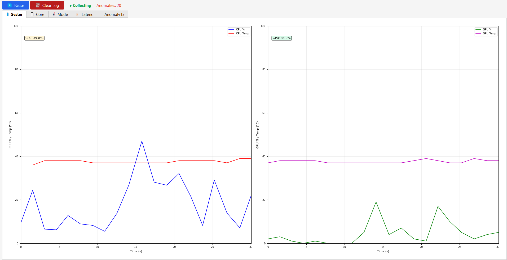
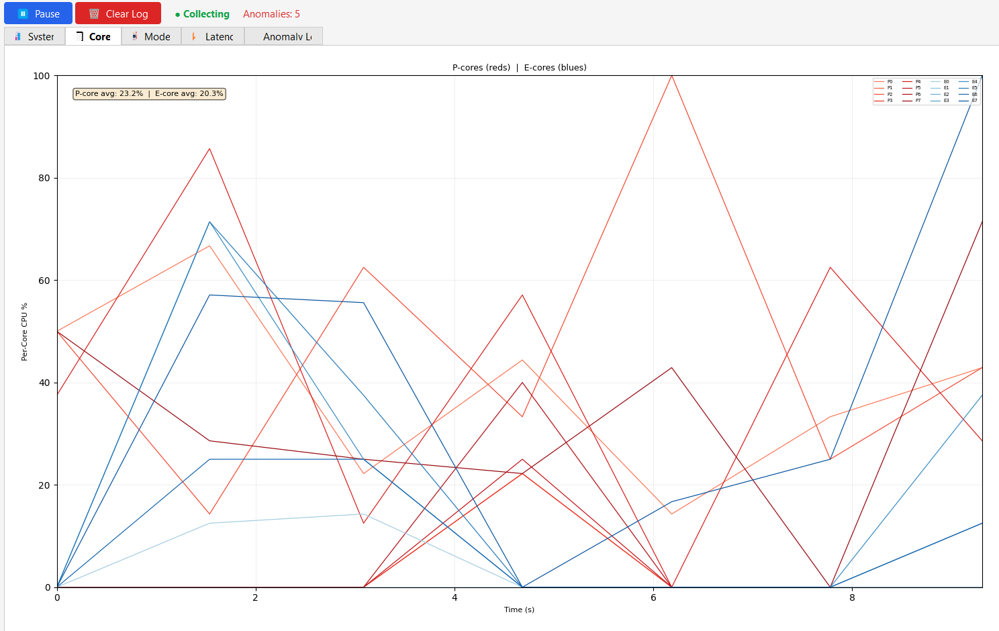
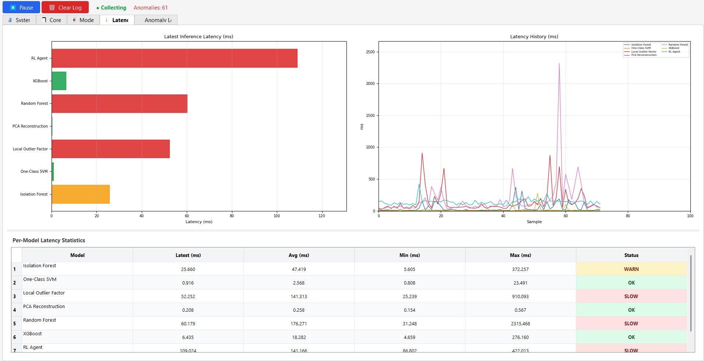
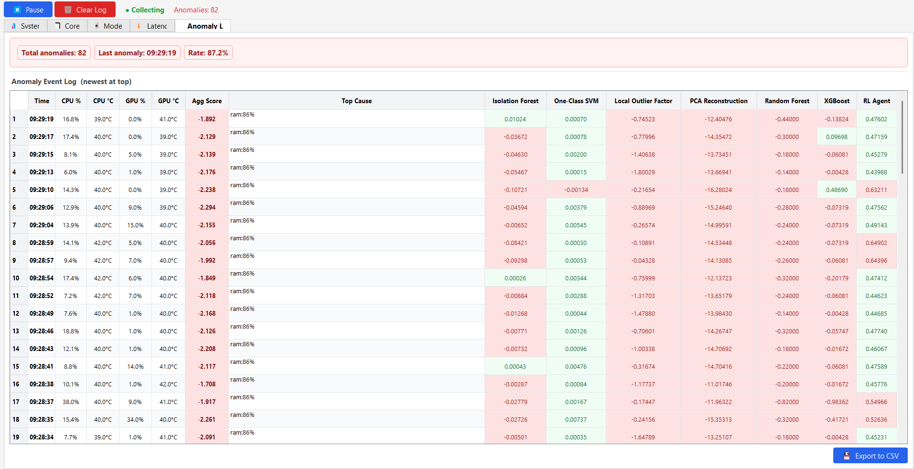
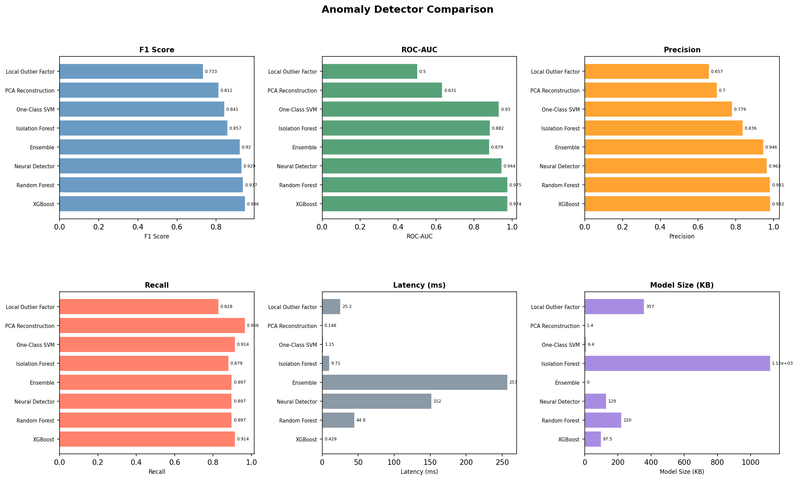

# ML System Anomaly Detector

A real-time system monitor that samples CPU/GPU hardware metrics once per second,
scores each sample with seven anomaly detectors in parallel, and displays the
results in a live PyQt5 dashboard while writing every sample to CSV.

---

## Dashboard

The GUI is organised into tabs, each surfacing a different layer of monitoring data.

<table>
  <tr>
    <td align="center" width="50%">
      
      <br/>
      <b>1 · System Overview</b>
      <br/>
      <sub>Live gauges for all 7 features — CPU usage, frequency, memory and temperature plus GPU load, memory and temperature.</sub>
    </td>
    <td align="center" width="50%">
      
      <br/>
      <b>2 · Per-Core CPU Usage</b>
      <br/>
      <sub>Utilisation by logical core. P-core/E-core labelling applies only on 16-thread CPUs; other core counts are shown as unknown.</sub>
    </td>
  </tr>
  <tr>
    <td align="center" width="50%">
      
      <br/>
      <b>3 · Model Score Timeline</b>
      <br/>
      <sub>Scrolling time-series of each detector's raw score. Samples where a detector failed are omitted rather than plotted as zero.</sub>
    </td>
    <td align="center" width="50%">
      
      <br/>
      <b>4 · Latency &amp; Performance Stats</b>
      <br/>
      <sub>Per-detector inference latency with rolling average, P99 and max.</sub>
    </td>
  </tr>
  <tr>
    <td align="center" colspan="2">
      
      <br/>
      <b>5 · Anomaly Event Log</b>
      <br/>
      <sub>Scrollable table of flagged samples with timestamp and per-detector scores.</sub>
    </td>
  </tr>
</table>

> The screenshots predate the detector-health and logging changes in this
> repository, so some labels differ from the current code.

---

## Benchmark Results

All eight configurations evaluated on the same held-out test set
(`data/labeled_test.csv`, 90 samples). Every figure below is copied from
[`comparison_results.csv`](comparison_results.csv) and is regenerated by
`python comparison.py`.

| Detector | F1 | ROC-AUC | Precision | Recall | Latency (ms) |
|---|---|---|---|---|---|
| XGBoost | 0.9464 | 0.9741 | 0.9815 | 0.9138 | 0.429 |
| Random Forest | 0.9369 | 0.9752 | 0.9811 | 0.8966 | 44.755 |
| Neural Detector | 0.9286 | 0.9440 | 0.9630 | 0.8966 | 151.633 |
| Ensemble | 0.9204 | 0.8788 | 0.9455 | 0.8966 | 257.231 |
| Isolation Forest | 0.8571 | 0.8825 | 0.8361 | 0.8793 | 9.706 |
| One-Class SVM | 0.8413 | 0.9305 | 0.7794 | 0.9138 | 1.150 |
| PCA Reconstruction | 0.8116 | 0.6315 | 0.7000 | 0.9655 | 0.148 |
| Local Outlier Factor | 0.7328 | 0.5005 | 0.6575 | 0.8276 | 25.171 |



Latency figures are machine-dependent and reflect whichever host last ran
`comparison.py`. The quality metrics are deterministic given the fixed seeds in
`seeds.py`.

Two caveats that affect how these numbers should be read:

- `detectors/split_data.py` splits the labeled data with a **random** stratified
  split, not a time-ordered one. The samples are a continuous 1 Hz recording, so
  consecutive seconds land on opposite sides of the split. The three highest
  scoring detectors are the three trained on that split.
- Local Outlier Factor's ROC-AUC of 0.5005 is not a sign error; flipping the
  score gives 0.4995. It operates on unscaled features, where `cpu_freq`
  accounts for over 99% of the variance, so its neighbour distances carry
  almost no information about system stress.

---

## What the monitor does

**Sampling.** `data_collector.py` reads seven features once per second:

| Feature | Source |
|---|---|
| `cpu_percent` | `psutil.cpu_percent()` |
| `cpu_freq` | `psutil.cpu_freq()` |
| `cpu_memory` | `psutil.virtual_memory().percent` |
| `cpu_temp` | WMI via OpenHardwareMonitor, on a background thread |
| `gpu_percent`, `gpu_memory`, `gpu_temp` | `GPUtil` |

When a reading is unavailable the collector reports `None`, never a substitute
value. GPU failures also set `gpu_available` to `False`. CPU temperature is
reported as `None` when no read has succeeded or the last good read is more than
10 seconds old. Each distinct failure reason is logged once, not once per sample.

A `None` never reaches a model. The collector substitutes the median of that
feature over `normal_training.csv` before predicting, and keeps the raw `None`
for the plots and the log.

This matters on any machine without an OpenHardwareMonitor temperature source
or a GPUtil-visible GPU. Passed through raw, a missing reading makes One-Class
SVM, LOF, PCA and XGBoost raise on every sample — all four are disabled within
three seconds, leaving three healthy detectors, below the four needed for a
verdict — so no anomaly is ever reported again for the rest of the session.
Isolation Forest, Random Forest and the neural network are worse still: they
accept the `NaN` and score it without complaint.

**Scoring.** Seven detectors score every sample independently. All use the same
convention: a higher score means more normal, and `pred` is `1` for normal,
`-1` for anomaly.

Isolation Forest, One-Class SVM and LOF report their estimator's raw decision
function, so their magnitude is only loosely bounded. Random Forest, XGBoost,
the neural detector and PCA are mapped onto `[-1, 1]`. That matters because
`EnsembleDetector` and the monitor's aggregate both *average* these scores: a
detector whose scale runs away decides the average on its own.

**Detector health.** A detector that raises is recorded as failed for that
sample — score, latency and prediction are `None`, not `0.0` — and is excluded
from the vote. After three consecutive failures it is disabled, and the
dashboard names it in the status bar.

**Verdict.** The 4-of-7 vote and the aggregate score are computed once per
sample in the collector, for every sample. If fewer than four detectors
reported, the verdict is marked invalid and the aggregate fields are null.

**Drift.** One Page-Hinkley tracker per detector, over that detector's own score
stream. The raw statistic is written to the log each sample. No threshold is
applied and no alert is raised. Non-finite scores are skipped, so a single NaN
cannot silently disable the tracker.

**Logging.** `logger.py` writes one row per sample to `logs/performance_log.csv`
plus a summary file on close. Missing values are written as empty fields.

---

## Quick Start

### 1. Install dependencies

```bash
pip install -r requirements.txt
```

On Windows, CPU temperature additionally requires [OpenHardwareMonitor](https://openhardwaremonitor.org/) to be running.

### 2. Collect baseline data

```bash
python collect_normal.py
```

Use the machine normally during collection. Writes `data/normal_training.csv`.

### 3. Collect labeled data

```bash
python collect_labeled.py
```

| Key | Action |
|-----|--------|
| `a` | Switch to **anomaly** mode (run a stress test now) |
| `n` | Return to **normal** mode |
| `q` | Stop early and save |

Writes `data/labeled_raw.csv`. Then split it:

```bash
python detectors/split_data.py
```

### 4. Train the neural detector

```bash
python train_neural.py
```

The other six detectors are trained at startup from the CSVs.

### 5. Benchmark

```bash
python comparison.py
```

Writes `comparison_results.csv` and `comparison_plots.png`.

### 6. Run the monitor

```bash
python monitor.py
```

### 7. Self-test

```bash
python monitor.py --selftest
```

Collects for 30 seconds with no GUI, then checks that the log has rows, that
latencies are not all identical, that the aggregate score is not constant, and
that every detector produced a varying score. Exits non-zero if any check fails.

### 8. Test suite

```bash
python -m pytest tests/
```

Regression tests for the detector contract, the ensemble vote, the handling of
missing sensor readings and the CSV schema. Tests that need `tensorflow` or
`xgboost` skip when those are not installed.

---

## Log Schema

`logs/performance_log.csv` has 43 columns: 15 shared, then four per detector.

| Column | Description |
|---|---|
| `timestamp`, `elapsed_s` | Unix time, and seconds since the logger opened |
| the 7 feature columns | Raw sample; empty when a reading was unavailable |
| `anomaly` | `1` normal, `-1` anomaly, empty when the verdict is invalid |
| `score` | Mean score across healthy detectors |
| `inference_latency_ms` | Summed latency across healthy detectors |
| `jitter_ms` | Actual interval minus the intended 1 s, in ms |
| `n_healthy` | Number of detectors that reported this sample |
| `verdict_valid` | `1` when at least four detectors reported |
| `<detector>_score` | That detector's score, empty if it failed |
| `<detector>_latency_ms` | That detector's inference time |
| `<detector>_ok` | `1` if it reported, `0` if it failed |
| `<detector>_ph_stat` | Its raw Page-Hinkley statistic |

---

## Project Structure

```
.
├── detectors/
│   ├── base.py                     # BaseDetector + FEATURE_ORDER
│   ├── isolation_forest.py
│   ├── oneclass_svm.py
│   ├── local_outlier.py
│   ├── pca_reconstruction.py
│   ├── random_forest.py
│   ├── xgboost_detector.py
│   ├── neural_detector.py
│   ├── ensemble_detector.py
│   └── split_data.py               # Stratified train/test split
│
├── scripts/
│   └── check_neural_model.py       # Manual scaler/model sanity check
│
├── tests/
│   └── test_detectors.py           # Regression tests (pytest)
│
├── data/                           # Created by the collection scripts
│   ├── normal_training.csv
│   ├── labeled_raw.csv
│   ├── labeled_training.csv
│   └── labeled_test.csv
│
├── monitor.py                      # GUI application, entry point, --selftest
├── data_collector.py               # Hardware metric collection
├── logger.py                       # Thread-safe CSV logger
├── console.py                      # UTF-8 console output
├── anomaly_detector.py             # RunningStats, AnomalyExplainer, DriftDetector
├── seeds.py                        # Central random seed control
│
├── collect_normal.py               # Step 1 - baseline data
├── collect_labeled.py              # Step 2 - labeled data
├── train_neural.py                 # Train the neural detector
├── comparison.py                   # Benchmark all detectors
│
├── neural_detector.keras           # Trained network weights
├── neural_detector_scaler.pkl      # StandardScaler for the neural detector
├── comparison_results.csv          # Benchmark output
├── comparison_plots.png            # Benchmark visualisation
└── requirements.txt
```

`anomaly_detector.py` also contains `RunningStats`, `AnomalyExplainer` and an
`AnomalyDetector` class that `monitor.py` does not use. Only `DriftDetector` is
wired in.

---

## Requirements

Pinned in [`requirements.txt`](requirements.txt). Tested against Python 3.11.

---

## Reproducibility

`seeds.py` defines a single `SEED = 42` and a `set_global_seeds()` that seeds
Python, NumPy and TensorFlow. It is called at the top of `comparison.py`,
`monitor.py` and `train_neural.py`. Detectors that accept a seed set it
explicitly. `OneClassSVM` and `LocalOutlierFactor` take no `random_state` and
are deterministic for a given training set.

---

## Known failure modes

TODO

---

## Limitations

TODO

---

## Which detector would I ship

TODO
